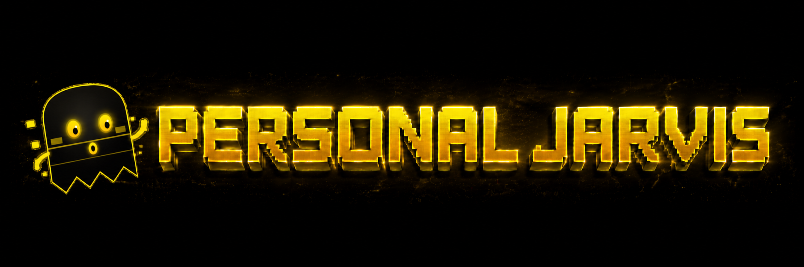

<p align="center">
  <a href="https://github.com/PersonalJarvis/PersonalJarvis">
    
  </a>
</p>

<h1 align="center">Contributing</h1>

<p align="center">
  Dev setup, the architecture worth knowing before you touch it, and what gets a PR merged.
</p>

<p align="center">
  <a href="https://github.com/PersonalJarvis/PersonalJarvis/pulls"></a>
  <a href="https://github.com/PersonalJarvis/PersonalJarvis/issues?q=is%3Aissue+is%3Aopen+label%3A%22good+first+issue%22"></a>
  <a href="https://discord.gg/x7USduHxbc"></a>
  <a href="LICENSE"></a>
</p>

> [!IMPORTANT]
> **Everything written into this repo is English**: code, comments, docstrings, docs, commit
> messages, PR text. Talk to us in whatever language you like, and the assistant itself
> speaks several at runtime, but the artifacts are English and CI checks it.

---

## Contents

- [What to work on](#what-to-work-on)
- [Before you start](#before-you-start)
- [Development environment](#development-environment)
- [The architecture worth knowing](#the-architecture-worth-knowing)
- [Plugin, tool, or skill?](#plugin-tool-or-skill)
- [Conventions](#conventions)
- [Testing](#testing)
- [Opening your PR](#opening-your-pr)
- [Community](#community)

---

## What to work on

Bug fixes come first, always: crashes, wrong behaviour, lost data, anything that made the
voice path worse than it was.

After that, cross-platform work. Linux, macOS, Windows and headless servers are equal here,
and a feature that only runs on one of them is unfinished rather than done. The reasoning is
in [`docs/PHILOSOPHY.md`](docs/PHILOSOPHY.md).

Then security hardening: prompt injection, the boundary between what the user said and what
a tool merely observed, the risk-tier policy, path traversal, privilege escalation. See
[`SECURITY.md`](SECURITY.md).

Then robustness and speed, which here mostly means voice latency, retry behaviour, honest
degradation, and the rule that a conversation never blocks.

New providers and plugins are welcome across all seven groups (wake, STT, TTS, brain,
harness, tool, channel). They have to stay provider-agnostic and pass the contract suite.
New skills are welcome when they are broadly useful; generated ones land as drafts and are
never activated on their own. Documentation fixes are welcome any time.

## Before you start

> [!TIP]
> For anything non-trivial, open an issue first so we can agree on the approach. It saves
> you from writing a PR that was never going to land.

Search the existing issues, and say hi on [Discord](https://discord.gg/x7USduHxbc). Keep each
PR to one logical change; it is far easier to review and merges much faster.

## Development environment

```bash
git clone https://github.com/PersonalJarvis/PersonalJarvis ~/personal-jarvis
cd ~/personal-jarvis

python -m venv .venv
source .venv/bin/activate            # Windows: .\.venv\Scripts\Activate.ps1

pip install -e . --no-deps            # activates the plugin entry-points
pip install -r requirements.txt       # runtime dependencies
pip install -e ".[dev]"               # pytest, ruff, mypy

python -m jarvis --wizard             # interactive first-run setup
python -m jarvis.ui.web.launcher      # run it (add --headless for a server)
```

> [!NOTE]
> After editing entry-points in `pyproject.toml`, re-run `pip install -e . --no-deps`. That
> is what activates new plugins, and skipping it is the single most common reason a plugin
> "does not exist". The frontend lives in `jarvis/ui/web/frontend/`: `npm install`, then
> `npm run dev` / `npm run build` / `npm run test`.

## The architecture worth knowing

Personal Jarvis is an 8-layer system. Four rules matter before you write anything:

Higher layers reach lower ones only through the protocols in `jarvis/core/protocols.py`.
Anything sideways goes over the EventBus as a typed, immutable event.

Everything streams. `Brain`, `STT`, `TTS` and `Harness` methods return an `AsyncIterator`,
and a provider that cannot stream yields exactly one element.

No vendor is load-bearing. Never hardcode one brain provider; `cfg.brain.primary` decides.

The router dispatches rather than doing. Heavy work becomes a mission in an isolated
`git worktree`, under a worker and critic loop.

For the deep version, read [`docs/LLM-CONTEXT.md`](docs/LLM-CONTEXT.md), which is a dense
engineering snapshot, [`CLAUDE.md`](CLAUDE.md) for the binding conventions, and
[`docs/PHILOSOPHY.md`](docs/PHILOSOPHY.md) for the cross-platform doctrine.

## Plugin, tool, or skill?

The most common design question. Pick the smallest thing that fits:

| | Plugin | Tool | Skill |
|---|---|---|---|
| What it is | A swappable provider | A brain-callable action inside one turn | An authored, multi-step workflow |
| Where it lives | `jarvis/plugins/<group>/`, one of 7 groups | Registered tool, run via `ToolExecutor` | Authored skill; generated ones start as `draft` |
| The rule you cannot break | No `import jarvis.*` in the module; new STT/Brain/Tool/Channel must pass `tests/contract/` | Never call `Tool.execute()` directly | Never auto-activated |

A swappable backend is a plugin. A single action the brain can call is a tool. A multi-step
workflow somebody wrote down is a skill.

> [!IMPORTANT]
> **Marketplace plugins** (the connectors in the app's Plugins store — GitHub, Notion,
> Slack, …) are a separate, fourth thing, and every NEW submission must be packaged per the
> vendor-neutral [Agent Plugins standard v1.0.0](https://agent-plugins.org/): a directory
> with a `plugin.json`, an `mcp.json` when the service has an MCP server, and everything
> Jarvis-specific under the `io.github.personaljarvis` extension namespace. The field
> mapping and the migration tracker for the existing catalog live in
> [`docs/marketplace/agent-plugins-standard.md`](docs/marketplace/agent-plugins-standard.md).

## Conventions

Most of these are enforced in CI, so you will find out either way. Better to know first:

| Area | The rule |
|---|---|
| Language | English artifacts only (CI `language-policy` gate) |
| Risk tier | `ToolExecutor.execute()` is the only authorized execution path |
| Router | `ROUTER_TOOLS` is a frozenset; no spawn tool in a worker tool set |
| Enum drift | Strings crossing module boundaries use the five-layer pattern plus a parity test |
| Config writes | Mutate `jarvis.toml` only via `config_writer` (lock, tempfile, BOM-safe) |
| Subprocess | Always pass `NO_WINDOW_CREATIONFLAGS` |
| Secrets | Only via `get_secret()`; never in code, config, or commits |
| Dependencies | No Windows-only or GPU-only dependency in the base install; extras only |

The full anti-pattern register is in [`docs/LLM-CONTEXT.md`](docs/LLM-CONTEXT.md).

## Testing

```bash
pytest tests/                 # full suite (asyncio_mode=auto)
pytest -m "not slow"          # fast subset
pytest tests/contract/ -v     # mandatory for new STT/Brain/Tool/Channel providers

ruff check jarvis/ && ruff format --check jarvis/
mypy jarvis/

cd jarvis/ui/web/frontend && npm run test && npm run build
```

Tests use fakes from `tests/fakes/`, not mocks. New providers have to pass the contract suite.

## Opening your PR

Run through this before you open it:

- [ ] Tests pass (`pytest`), including `tests/contract/` for new providers
- [ ] `ruff` and `mypy` are clean; the frontend builds and `vitest` is green
- [ ] Everything new or changed is English (the CI language gate is required)
- [ ] New wire-format enums use the five-layer pattern plus a parity test
- [ ] No new base-install dependency on Windows-only or GPU-only packages
- [ ] User-facing changes update the docs and `CHANGELOG.md`

Describe what changed and why, and link the issue it closes. By contributing you agree your
work is licensed under the [MIT License](LICENSE).

## Community

<p align="center">
  <a href="https://discord.gg/x7USduHxbc"></a>
  <a href="https://x.com/Ruben_Luetke"></a>
</p>

<p align="center">
  <a href="https://discord.gg/x7USduHxbc">Discord</a> ·
  <a href="https://x.com/Ruben_Luetke">X</a> ·
  <a href="https://github.com/PersonalJarvis/PersonalJarvis/issues">Issues</a>
</p>
